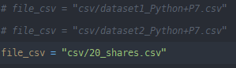

# AlgoInvest&Trade

## Cloner le projet


````bash
$ git clone https://github.com/Jogodev/P7_algo_invest.git
$ cd P7_algo_invest
````

### Créer l'environnement virtuel

````bash
$ python -m venv env
````

### Activater l'environnement virtuel

#### Windows
````bash
$ . env\scripts\activate 
````
#### Mac
````bash
$ source env\scripts\activate 
````
#### linux
````bash
$ source env\scripts\activate 
````

### Installer les paquets

````bash
$ pip install -r requirements.txt
````

## Lancer le programme
### Version bruteforce

````bash
$ python bruteforce.py
````
#### Cette commande fera le calcul du fichier csv de 20 actions pour un montant total de 500 €
### Version dynamique

````bash
$ python optimized.py
````
#### Cette commande fera le calcul du fichier csv de 20 actions pour un montant total de 500 €.
#### Pour lancer le programme sur un autre dataset décommenter celui_ci en haut du ficher optimized.py

